  

## 📌 About Me
- 🌱 I'm currently learning — AI agent development, LangChain, and RAG pipelines
- 👯 I'm looking to collaborate on — fullstack platforms, AI-powered tools, and open source dev utilities
- 🤝 I'm looking for help with — scaling NexPath's AI career advisory engine and Mindloom's editorial platform

## 🧠 My Focus Areas
- Frontend & UI Engineering
- AI/ML Tooling & Agent Systems
- Blockchain Development
- Full Stack Web Applications
- Open Source Contribution

## 📊 GitHub Stats & Trophies

  
  

  

  

  

## 🛠️ Languages & Tools

<h3 align="center">Programming Languages</h3>

  &nbsp;
  &nbsp;
  &nbsp;
  &nbsp;
  

<h3 align="center">Frontend</h3>

  &nbsp;
  &nbsp;
  &nbsp;
  &nbsp;
  &nbsp;
  

<h3 align="center">Backend</h3>

  &nbsp;
  &nbsp;
  &nbsp;
  

<h3 align="center">Database</h3>

  &nbsp;
  &nbsp;
  

<h3 align="center">DevOps & Cloud</h3>

  &nbsp;
  

<h3 align="center">Tools</h3>

  &nbsp;
  &nbsp;
  &nbsp;
  

  

## 🔗 Connect with Me

  &nbsp;&nbsp;
  &nbsp;&nbsp;
  

  

  

